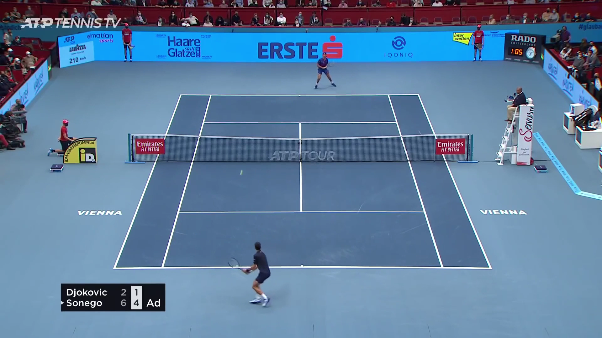
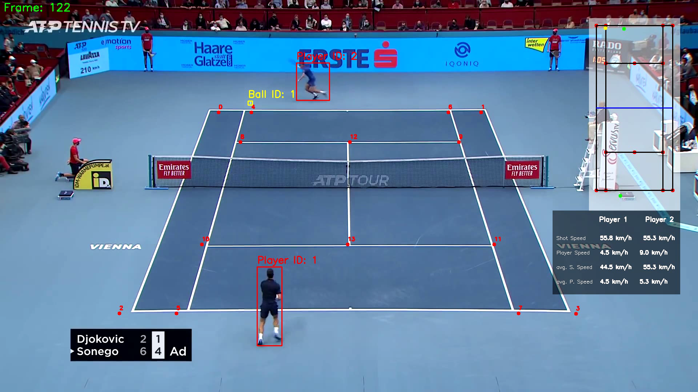

AI-Powered Tennis Match Analysis system with YOLO, PyTorch, and Key Point Extraction
# NetGenius: AI-Powered Tennis Match Analysis System

NetGenius is an advanced AI-powered system designed to analyze tennis matches by detecting and tracking players and the tennis ball in videos. It utilizes state-of-the-art machine learning techniques, including YOLO for object detection and CNNs for court keypoint extraction, to provide comprehensive insights into player performance.

<!-- screenshot -->
### Input video


### Output video


## Features

- **Player and Ball Detection**: Detects and tracks players and the tennis ball using YOLO.
- **Court Keypoint Extraction**: Extracts keypoints of the tennis court using CNNs.
- **Player and Ball Statistics**: Calculates various statistics such as player speed, ball shot speed, and the number of shots.
- **Visual Output**: Generates annotated videos with detailed visualizations of detections and statistics.

## Project Structure

The project is organized into several stages:

1. **Input Pipeline**: Loads and preprocesses the input video.
2. **Player and Ball Detection**: Detects players and the ball in video frames.
3. **Courtline Detection**: Identifies court lines and keypoints.
4. **Minicourt Construction**: Builds a scaled-down representation of the court for easier analysis.
5. **Player Stats Calculation**: Computes various player and ball statistics.
6. **Output Drawing**: Annotates the video with detected objects and statistics.

## Dataset used for training the model
This project uses the following dataset:

**tennis ball detection Dataset**

- **Author:** Viren Dhanwani
- **Type:** Open Source Dataset
- **Published On:** Roboflow Universe
- **Publisher:** Roboflow
- **Year:** 2023
- **Month:** February
- **URL:** [https://universe.roboflow.com/viren-dhanwani/tennis-ball-detection](https://universe.roboflow.com/viren-dhanwani/tennis-ball-detection)
- **Note:** Visited on 2024-05-28 
## Installation

1. Clone the repository:
   ```bash
   git clone https://github.com/yash-raj202134/NetGenius.git
   cd NetGenius
   ```

2. Activate env:
   ```bash
   conda activate tennisCV
   ```

3. run the main script:
   ```bash
   python main.py
   ```


## Requirements
To execute this project, you must have the following dependencies installed:
- Ultralytics
- roboflow

(see requirements.txt)

## License
This project is licensed under the GNU License. See the LICENSE file for more details.
## Author 
Feel free to contact :
- Email : [yashraj3376@gmail.com]
